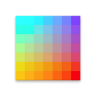
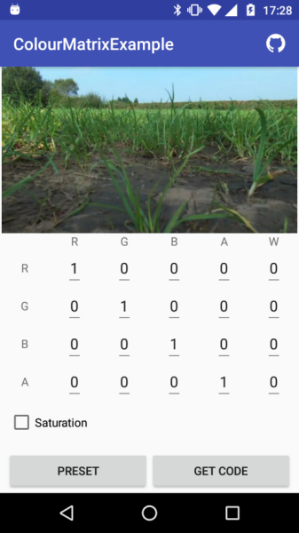
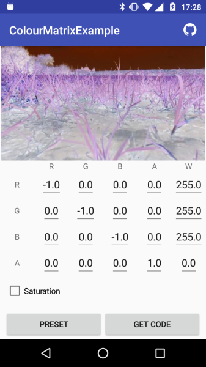
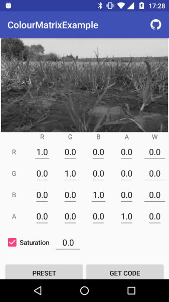
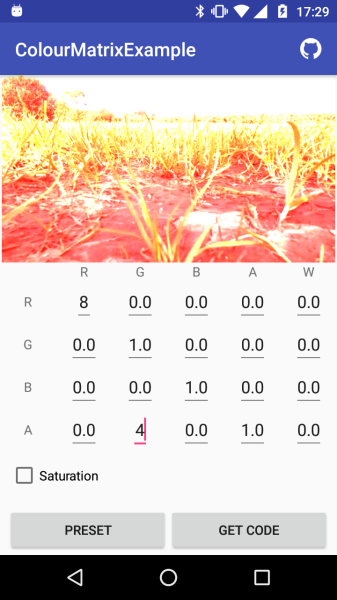

# Interactive ColorMatrix Demo 

So if you, like me, don't have any clue how to understand or use a ColorMatrix this is a good way to start. Just have a play around with the values and see what funky effects that has on the image.

## General info

## Usage

Just play around with the values to see what happens to the image. Use the presets for examples of what can be done. Use Identity(Reset) to reset to defaults.

## Screnshots 
 
 
 
 

### More info

[ColorMatrix - Android Developer Page](https://developer.android.com/reference/android/graphics/ColorMatrix.html)

### Permissions
None

## Building

It's a standard gradle project.

# Contributing

I welcome pull requests, issues and feedback.

- Fork it
- Create your feature branch (git checkout -b my-new-feature)
- Commit your changes (git commit -am 'Added some feature')
- Push to the branch (git push origin my-new-feature)
- Create new Pull Request

